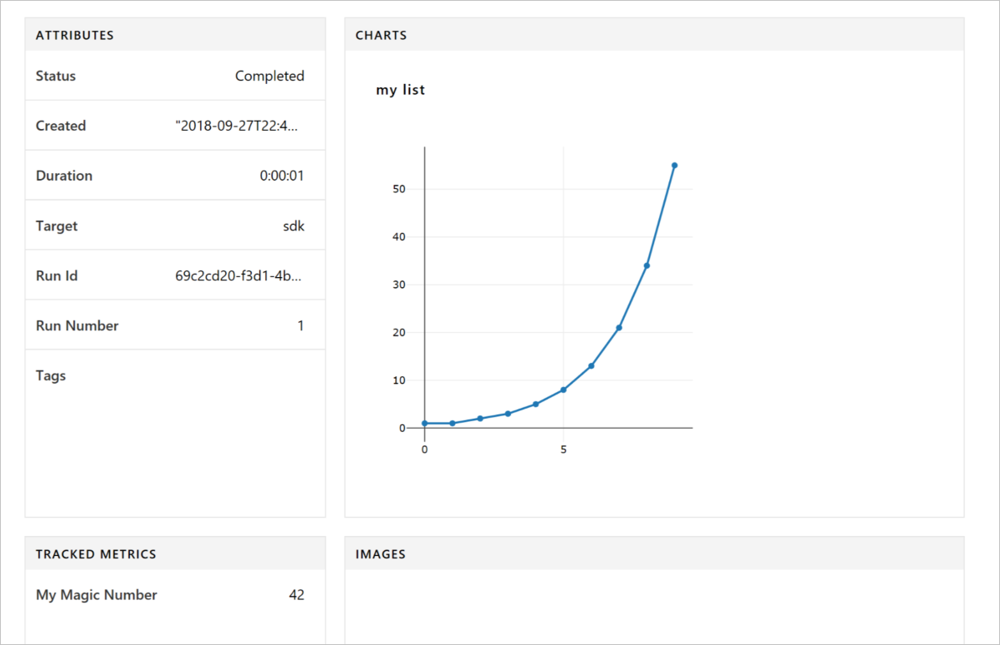

You may notice that, depending on your local machine capacity, it takes a long time to fit models with parameters of different values, or to find k that returns best results. In this case, you should try to run the model on a remote cluster.

## Run and Experiment Overview

Before you begin, it is imperative to familiarize ourselves with two concepts: run and experiment.

**Run**, within the context of the Azure Machine Learning service, refers to Python code for a specific task, for example, training a model or tuning hyperparameters. Run does the job of logging metrics and upload result to Azure platform, it's a more natural way to keep track of jobs in your Workspace.

**Experiment** is a term referring to a composition of a series of runs. In the example, you have one run for the logistic regression model and another for the KNN model, and together they make up an experiment for you to compare results.

## Create an Experiment

Since you have already created a workspace in the first module, you need to access it using the code below. Log in with your Azure account if required. Replace name, subscription_id, and resource_group parameters with ones from your workspace.

```python
# import package and use get function to access Workspace
from azureml.core import Workspace,Experiment ,Run
from azureml.core import Workspace
ws = Workspace.get(name='course_trial',
                      subscription_id='61f7cffa-e418-4a80-9679-ef35724532a8', 
                      resource_group='docsaml' 
                     )
```

Now, you create an experiment and a run within this workspace using the following code:

```python
#Create an experiment
experiment = Experiment(workspace = ws, name = "my-first-experiment")
#Create a run
run = experiment.start_logging()
run.log("trial",1)
run.complete()
```

View logged results

When the run finishes, you can view the experiment run in the Azure portal. To print a URL that navigates to the results for the last run, use the following code:

```python
print(run.get_portal_url())
```

Use the link to view the logged values in the Azure portal in your browser.

