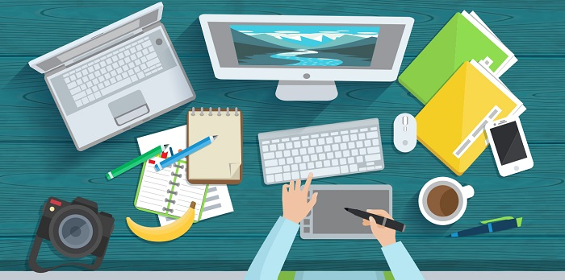

There are many types of computers that are used for everyday tasks.

In this lesson, we'll explore what a computer is, the parts of a computer and how to interact with a computer.

**By the end of this lesson you will be able to:**

*   Describe the functions of a computer.

*   Differentiate between computer hardware and software.

*   Describe the primary parts of a computer and the use of each part.

*   Describe the various types of modern personal computing devices and their uses.

Keep the following **guiding questions** in mind as you complete this lesson. See if you can answer them on your own at the end of the lesson:

1.  What are the primary functions of a computer?

2.  What is the difference between computer hardware and software?

3.  What are the primary hardware parts that make up a computer?

4.  What are the common types of personal computing devices?